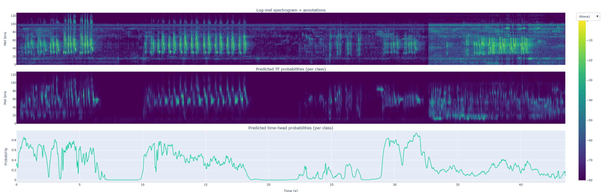
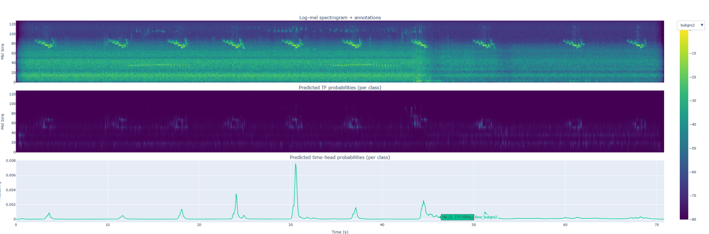

# Bird Vocalization Event Detector (CRNN)

**Author:** Mark Slipenkyi

**Date:** 2025

**Task:** Multi-label audio classification and time-frequency event detection.

## 📌 Project Overview

This project implements a Convolutional Recurrent Neural Network (CRNN) to identify and localize bird species in audio recordings. The model processes log-mel spectrograms to provide:

1. **Species Identification:** Probability scores across 28 bird species.
2. **Temporal Localization:** Identification of *when* a bird is singing.
3. **Frequency Localization:** Identification of the frequency range (Hertz) of the vocalization.

## 📊 Dataset

The data is sourced from the [Fully-annotated soundscape recordings from the Southwestern Amazon Basin](https://zenodo.org/records/7079124).

* **Audio:** 21 hours of 48 kHz recordings (resampled to 32 kHz).
* **Labels:** 14,798 manually annotated time-frequency bounding boxes.
* **Scope:** Focused on the 28 most frequent species (those with >150 occurrences) to mitigate class imbalance.

## 🏗 Project Structure

```text
├───src
│   │   data_review.ipynb       # Exploratory Data Analysis
│   │   train_iso.ipynb         # Isolated training experiments
│   ├───classes
│   │       BirdDataset.py      # Custom PyTorch Dataset (Log-Mel conversion)
│   │       BirdModels.py       # CRNN Architecture (CNN + GRU)
│   ├───common
│   │       metrics.py          # Macro-Averaged F1, Dice, and Precision/Recall
│   │       plotting.py         # Result visualization
│   └───scripts
│           train_config.json   # Hyperparameters
│           train_script.py     # Training pipeline in script form
└───stable_logs                 # Saved metrics and training plots

```

## 🚀 Model Architecture

The model utilizes a **CNN backbone** for spatial feature extraction from spectrograms, followed by **Gated Recurrent Units (GRU)** to capture the temporal rhythm of bird songs.

* **Primary Metric:** Macro-Averaged F1 Score.
* **Loss Function:** `BCEWithLogitsLoss` with positive weights for sparse labels.

## 📈 Results & Detections

The model demonstrates relative precision in identifying most recurring species in various environments with multiple overlapping vocalizations.

### Training Progress

To improve the signal-to-noise ratio, the training dataset was augmented by removing background noise in Adobe Audition.

Because bird vocalizations are sparse, all classes were boosted during training using pos_weight in the BCEWithLogitsLoss function.

Below are examples of the model's ability to detect species like the **Thrush-like Wren** and **Amazonian Grosbeak**.




